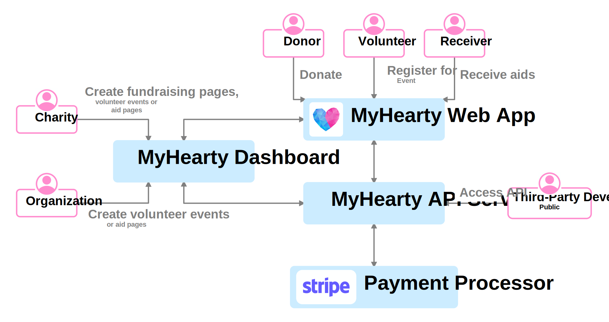
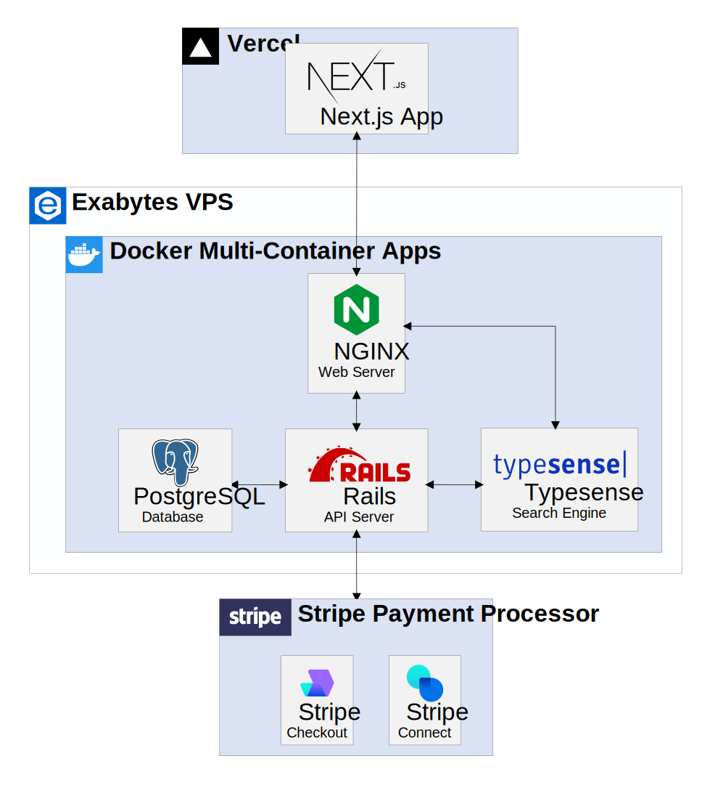
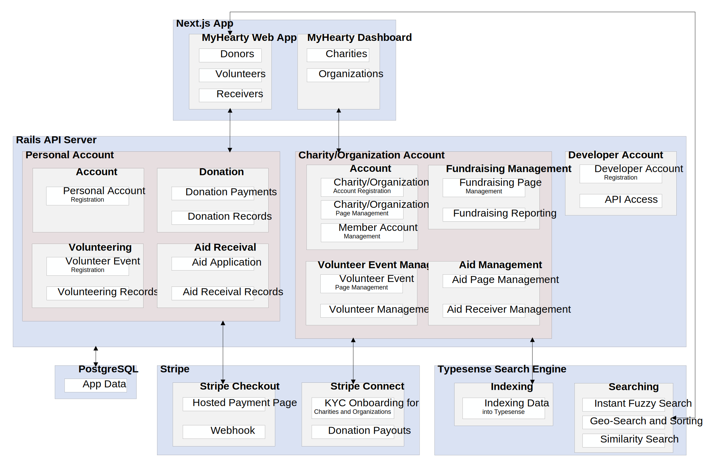
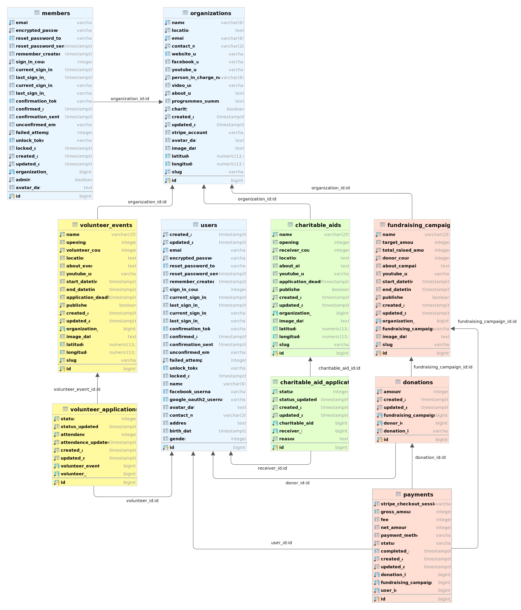

  
  <h2 align="center">MyHearty</h2>
  

    A one-stop charity website to fundraise, donate, volunteer and apply for aids
     
     
    <a href="https://www.myhearty.my">Website</a>
    ·
    <a href="https://dashboard.myhearty.my">Dashboard</a>
  

---

# MyHearty: Documentation

This repository contains the project overview, technical documentation and architecture diagrams of MyHearty. The documentation serves as a permanent record for the project implementaton.

## About The Project

MyHearty is a one-stop, centralized charity website for people to fundraise, donate, volunteer and apply for aids. The motivation behind this project stems from the idea of integrating fundraising, donation, volunteering and aiding functions into a single platform with API access. This project aims to connect various parties that are involved in charity via a centralized platform and provide open charity data via an API.

## Big Picture

Figure 1 shows a big picture overview of MyHearty. The proposed solution consists of 3 parts: MyHearty Website, MyHearty Dashboard and MyHearty API Server. There are 6 types of users involved, which are charities, organizations, donors, volunteers, receivers and third-party developers. 

|  |
| :-----------------------------------------------------------: |
|        **Figure 1: Big picture overview of MyHearty**         |

Via MyHearty Dashbaord, both charities and organizations can create volunteer event and aid pages. However, only charities can create fundraising campaigns pages to accept donations from the public. For MyHearty Website, donors can donate for a fundraising campaign, volunteers can register for volunteer events and receivers can apply for available charitable aids. Both the dashboard and the website are powered by MyHearty API that serves JSON responses to the frontend API clients. The API server also allows third-party developers to access charity data, thus opening up chances for developers to build custom integrations into their platforms. Besides, Stripe will be used as the payment processor for donations made on MyHearty Website.

## High-Level Architecture

|  |
| :------------------------------------------------------------------------------------------------------------: |
|                                 **Figure 2: High-level architecture diagram**                                  |

## Detailed-Level Architecture

|  |
| :-------------------------------------------------------------------------------------------: |
|                       **Figure 3: Detailed-level architecture diagram**                       |

## Database Diagram

|  |
| :----------------------------------------------------------------: |
|                   **Figure 4: Database diagram**                   |
